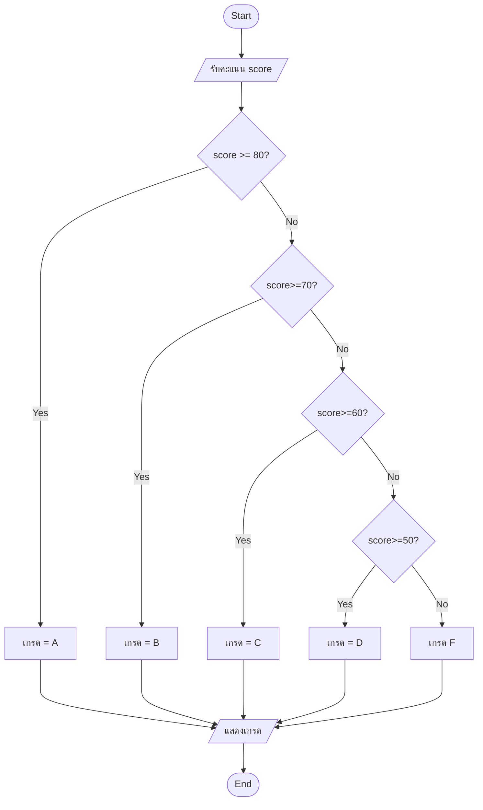
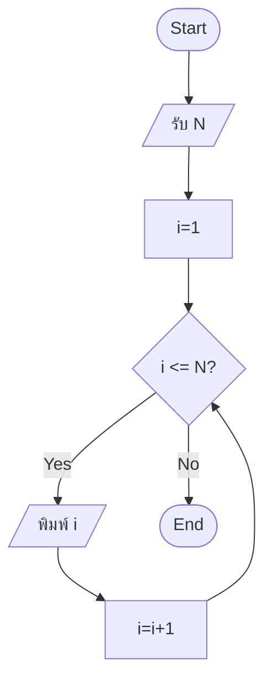

```mermaid
flowchart TD
    Start([Start]) --> Input[/รับคะแนน score/]
    Input --> D1{score >= 80?}
    D1 -->|Yes| A[เกรด = A]
    D1 -->|No| D2{score>=70?}
    D2 -->|Yes| B[เกรด = B]
    D2 -->|No| D3{score>=60?}
    D3 -->|Yes| C[เกรด = C]
    D3 -->|No| D4{score>=50?}
    D4 -->|Yes| D[เกรด = D]
    D4 -->|No| F[ เกรด F]
    A & B & C & D & F ---> output[/แสดงเกรด/]
    output --> End([End])
```

``````mermaid
flowchart TD
    Start([Start]) --> Input[/รับ A&B/]
    Input --> D1{ A > B?}
    D1 -->|Yes| a[/แสดง A/]
    D1 -->|No| b[/แสดง B/]
    a & b-->End([End])
``````


```mermaid
flowchart TD
    Start([Start]) --> Input[/รับ N/]
    Input --> N[i=1]
    N --> D1{ i <= N?}
    D1 -->|Yes| N2[/พิมพ์ i/]
    D1 -->|No| End([End])
    N2 --> P[i=i+1] --> D1
```

```

```
