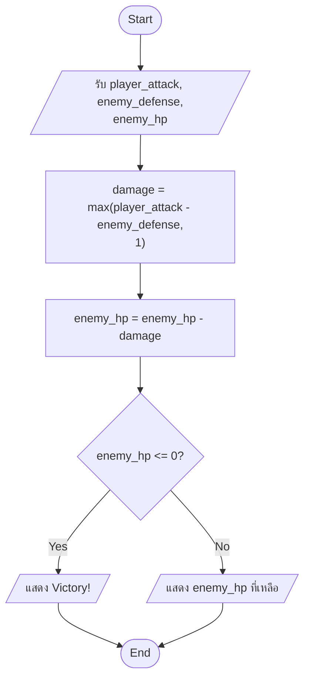
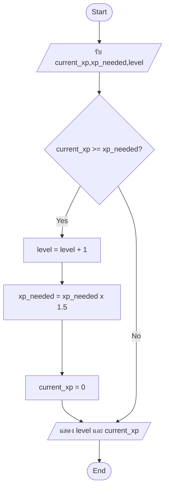

```mermaid
flowchart TD
Start([Start]) --> Input[/รับ player_attack, enemy_defense,
enemy_hp/]
Input --> Calc["damage = max(player_attack - enemy_defense,
1)"]
Calc --> Reduce["enemy_hp = enemy_hp - damage"]
Reduce --> D1{enemy_hp <= 0?}
D1 -->|Yes| Win[/แสดง Victory!/]
D1 -->|No| Show[/แสดง enemy_hp ที่เหลือ/]
Win & Show --> End([End])

```

---

```mermaid
flowchart TD
  Start([Start]) --> Input[/รับ current_xp,xp_needed,level/]
  Input --> D1{current_xp >= xp_needed?}
  D1 --> |Yes| N1["level = level + 1"]
  N1 --> Xp1[" xp_needed = xp_needed x 1.5 "]
  Xp1 ---> Xp2["current_xp = 0"]
  Xp2 --> S[/แสดง level และ current_xp /]
  D1 --> |No| S[/แสดง level และ current_xp /]
  S --> End([End])
```
